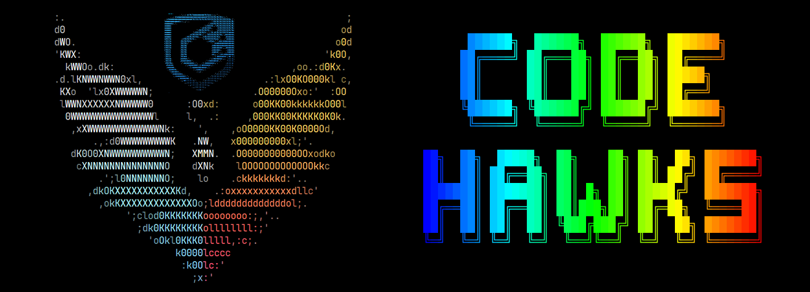

[](https://www.codehawks.com/)

# CodeHawks Docs

This repo contains the source code for the CodeHawks docs site.

## Requirements

- [git](https://git-scm.com/book/en/v2/Getting-Started-Installing-Git)
  - You'll know you did it right if you can run `git --version` and you see a response like `git version x.x.x`
- [pnpm](https://pnpm.io/)
  - You'll know you did it right if you can run `pnpm --version` and you see a response like `x.x.x`

## Quickstart

1. Clone repo and install dependencies
```bash
git clone https://github.com/Cyfrin/codehawks-docs
cd codehawks-docs
pnpm install
```

2. Start local server

```bash
pnpm dev
```

# Thank you!

We are always open to contributions, feel free to make a PR to improve the docs!