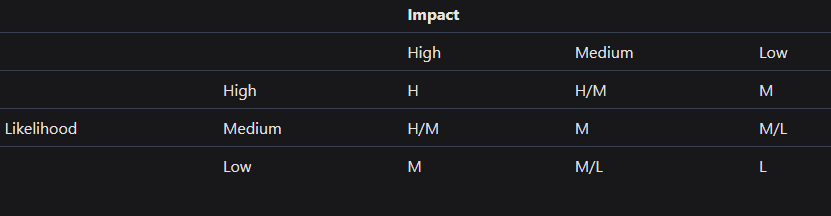

# How to Evaluate a Finding Severity

When identifying vulnerabilities in a codebase, it's crucial to assess the potential impact and risk associated with them. Findings, or vulnerabilities, are separated into three categories:&#x20;

* High,&#x20;
* Medium
* Low severity.&#x20;

These severities help stakeholders prioritize and address the issues appropriately. For auditors, finding higher severity findings will make you ranking higher in the contest leaderboard.

### Criteria for Categorising Severity

The severity of a finding can be categorized as **High**, **Medium**, or **Low** and is determined based on several factors:

1. **Impact on the protocol:** How severe would the potential damage be to the protocol if the vulnerability were exploited?
2. **Likelihood of exploitation:** How probable is it that an attacker would exploit this vulnerability?
3. **Degree of judge/protocol subjectivity**

<figure><figcaption>
Impact vs Likelihood Matrix
</figcaption></figure>

### How to Evaluate Findings **Impact on the protocol**:

Impact refers to the potential harm or consequence to the users or the protocol due to the vulnerability.

* **High Impact**:
  * Funds are directly or nearly directly at risk.
  * There's a severe disruption of protocol functionality or availability.
* **Medium Impact**:
  * Funds are indirectly at risk.
  * There's some level of disruption to the protocol's functionality or availability.
* **Low Impact**:
  * Funds are not at risk.
  * However, a function might be incorrect, state might not be handled appropriately, etc.

### How to evaluate the **Likelihood of exploitation**

Likelihood represents the probability of the impact occurring due to the vulnerability.

* **High Likelihood**:
  * Highly probable to happen. For instance, a hacker can call a function directly and extract money.
* **Medium Likelihood**:
  * It might occur under specific conditions. For example, a peculiar ERC20 token is used on the platform.
* **Low Likelihood**:
  * Unlikely to occur. An example might be if a hard-to-change variable is set to a unique value on a very specific block.

**Note**: There are instances where the likelihood is deemed "computationally infeasible". For example, "An attacker could guess the user's private key". In such scenarios, the onus is on the finding's author to demonstrate that their finding is computationally feasible.

### Examples of High Medium and Low severity findings

### High Severity Findings

**Properties:**

* Direct impact on the funds or the main functionality of the protocol.
* The attack path is straightforward.
* The vulnerability is easily exploitable, leading to significant damage.

**Example:**\
[See Detailed High Severity Finding](https://solodit.xyz/issues/boostsetlockstatus-should-update-the-callers-rewards-first-hans-none-meta-markdown\_)

For more examples of High severity findings, visit [Solodit](https://solodit.xyz/).

### Medium Severity Findings

**Properties:**

* Indirect impact on the funds or the protocol's functionality.
* The attack path isn't straightforward and needs specific conditions to be met.
* Though the vulnerability might cause harm, exploiting it is challenging.

**Example:**\
[See Detailed Medium Severity Finding](https://solodit.xyz/issues/the-off-chain-mechanism-must-be-ensured-to-work-in-a-correct-order-strictly-cyfrin-none-cyfrin-stake-link-markdown)

For more examples of Medium severity findings, visit [Solodit](https://solodit.xyz/).

### Low Severity Findings

**Properties:**

* Minimal to no impact on the funds or the protocol's main functionality.
* The vulnerability doesn't lead to tangible real-world damage.
* The path to exploit is either non-existent or highly improbable.

**Example:**\
[See Detailed Low Severity Finding](https://solodit.xyz/issues/l-06-erc1155action-returns-false-on-supportsinterface-with-the-real-erc1155-interface-code4rena-notional-notional-contest-git)

For more examples of Low severity findings, visit [Solodit](https://solodit.xyz/).

***

### Subjectivity in Classification

While the Impact vs Likelihood matrix provides a structured approach, there remains a degree of subjectivity in classifying findings. The judge's discretion plays a pivotal role in the final determination of a finding's category.

If the protocol under audit stipulates particular criteria, then those guidelines should be the benchmark for classifying findings.

***

### Non-Acceptable Severity

As of August 18th, 2023, CodeHawks is no longer accepting submissions with a severity of Gas, QA, or Informational. Ensure that the vulnerabilities you are submitting have a direct or indirect impact on the protocol and are not merely gas optimizations, quality assurance issues, or informational insights.

***

For more information on how to write and submit findings, refer to the [How to write and submit a finding](how-to-write-and-submit-a-finding.md) guide.
